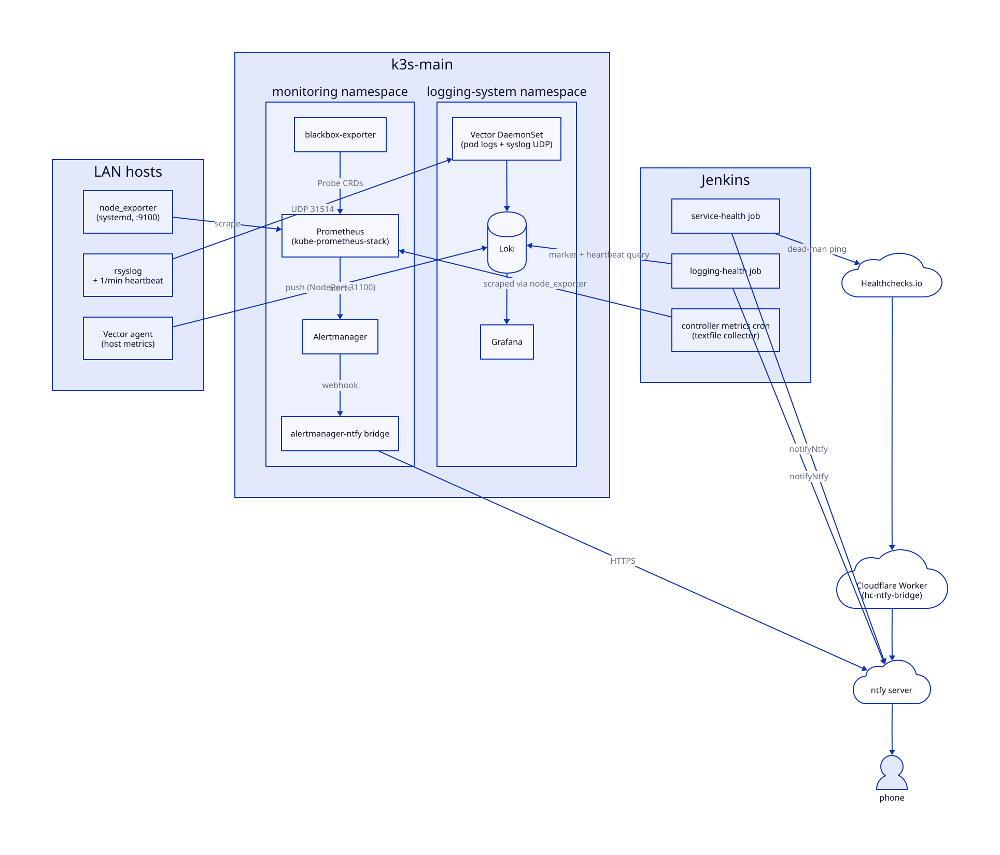
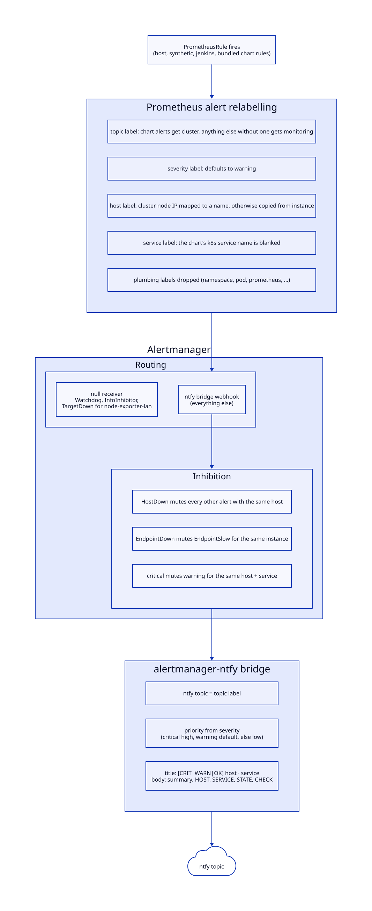

# homelab-observability-stack

Metrics, alerting and logging for a small self-hosted homelab: Prometheus and Alertmanager on k3s, node_exporter across the fleet, blackbox probes, a Vector → Loki → Grafana log pipeline, and ntfy push notifications with Nagios-style messages.

This is a curated extract from a working homelab. The code runs in production there. Host names are functional roles (`k3s-main`, `nas`, `db-host`, ...), and all addresses, domains and secret names are placeholders (`192.0.2.x`, `198.51.100.x`, `*.example.com`, `*.example.internal`, `homelab/<svc>/<key>`).

## Architecture



### Metrics and alerting

- **kube-prometheus-stack** (Helm, `ansible/files/kube-prometheus-stack-values.yaml`): Prometheus (30d / 8GB retention), Alertmanager, the operator, kube-state-metrics and the in-cluster node-exporter. The chart's own Grafana is disabled. Selectors are relaxed so any PrometheusRule / Probe / ServiceMonitor in any namespace is picked up.
- **node_exporter fleet** (`roles/node_exporter`): a pinned release installed as a hardened systemd unit on every `monitored_hosts` member. NFS/CIFS filesystems are excluded from the filesystem collector so a stalled NAS can't hang the scrape and make healthy clients look down. The textfile collector is enabled for custom metrics. LAN hosts are scraped by a static `node-exporter-lan` job that sets a friendly `instance` label per host.
- **Blackbox probes** (`roles/blackbox_exporter` + `files/prometheus-rules/probes.yaml`): Probe CRDs for public HTTPS endpoints, internal HTTPS endpoints behind the reverse proxy, and raw TCP (Postgres, NFS, rpcbind). `metricRelabelings` stamp each target with the `host` that serves it and a human `service` name.
- **Alert rules** (`files/prometheus-rules/`): `host.yaml` (HostDown, disk, inodes, memory, swap-in pressure, CPU, read-only FS, NFS client stalls), `synthetic.yaml` (EndpointDown, EndpointSlow, TLS expiry), and `jenkins.yaml` (no agents online, queue backlog, stuck build, controller down, stale metrics). The Jenkins alerts read textfile metrics that `files/homelab-jenkins-metrics.sh` writes from cron on the controller, so they keep working when every build agent is offline.
- **Alert shaping** (`additionalAlertRelabelConfigs`): every alert is guaranteed a `topic` (chart alerts → `cluster`, anything else without one → `monitoring`), a `severity` and a `host`; bundled chart alerts have their k8s `service` label blanked so the bridge falls back to the alert name. Plumbing labels are dropped so the phone notification isn't buried in tags.
- **Alertmanager routing**: everything goes to the ntfy bridge, except `Watchdog`, `InfoInhibitor` and `TargetDown` for the LAN job (which duplicates HostDown without naming the host), which go to a null receiver. Inhibition rules:
  - `HostDown` suppresses every other alert with the same `host`, so a dead box sends one notification instead of a dozen.
  - `EndpointDown` suppresses `EndpointSlow` for the same instance.
  - A `critical` suppresses a `warning` for the same `host` + `service`.
- **ntfy bridge** (`roles/alertmanager_ntfy_bridge`): [alexbakker/alertmanager-ntfy](https://github.com/alexbakker/alertmanager-ntfy), deployed with its config (including the ntfy token pulled from AWS Secrets Manager) in a Secret. The ntfy topic comes from the alert's `topic` label and the priority from `severity`. Messages use a Nagios-style layout:

  ```
  [CRIT] nas · Disk space

  nas: /mnt/archive is over 95% full

  HOST     nas
  SERVICE  Disk space
  STATE    critical
  CHECK    DiskCritical
  ```

  The bridge reads its config only at startup, so the role restarts the Deployment whenever the rendered Secret changes.

The path an alert takes from rule to phone:



### Logging

- **Loki** 2.9 (`kubernetes/logging-system/loki/`): single-binary StatefulSet using TSDB on filesystem storage, backed by an NFS PersistentVolume on the NAS, with 30-day retention. Exposed on NodePort 31100 for collectors outside the cluster.
- **Vector DaemonSet** (`kubernetes/logging-system/vector/`): collects Kubernetes pod logs (labelled with cluster/namespace/pod/app) and runs a syslog UDP listener on NodePort 31514 for every LAN host.
- **rsyslog forwarding + heartbeat** (`ansible/playbooks/configure_rsyslog_forwarding.yml`, `configure_log_heartbeat.yml`): every host forwards syslog to Vector and logs a `homelab-heartbeat` line once a minute, so liveness doesn't depend on how chatty a host is.
- **Vector host agent** (`roles/vector_agent`): turns host metrics into log lines and pushes them to Loki. Supports both systemd and SysV-init hosts.
- **Grafana** 10.2 (`kubernetes/logging-system/grafana/`): a provisioned Loki datasource and ten file-provisioned dashboards (syslog overview, host explorer, security/auth, nginx, CoreDNS, Jenkins, and several per-app views). The admin password is fetched from AWS Secrets Manager by an init container.

### Synthetic health jobs (`services/`)

- **service-health**: a Jenkins job that runs every 5 minutes. `check.py` reads `services.yaml` and runs `http_get`, `icecast_mount`, `stream_bytes`, `tcp_connect` or `dns_resolve` checks. It pages ntfy only after 5 consecutive failures, sends a recovery message only if a page went out, and pings a Healthchecks.io dead-man URL on every run.
- **logging-health**: a Jenkins job that runs every 5 minutes. It sends a unique marker through `logger`, checks that it arrives in Loki, and confirms every expected host has heartbeated in the last 5 minutes. It uses the same hysteresis with N=3.
- **hc-ntfy-bridge**: a Cloudflare Worker that lets external senders such as Healthchecks.io publish to ntfy through Cloudflare Bot Fight Mode. It checks a bridge secret and swaps it for a least-privilege ntfy token.

## How it's deployed

- **Ansible via Jenkins.** `ansible/Jenkinsfile` is a parameterised job: pick a playbook (and optionally `LIMIT` / `EXTRA_VARS`) and it runs `ansible-playbook` inside a pinned Ansible container image. The k8s-facing roles run on the k3s control node and call `k3s kubectl` / `helm` with the local kubeconfig. Typical order:
  1. `deploy_prometheus_stack.yml`: Helm install of kube-prometheus-stack
  2. `deploy_alertmanager_ntfy_bridge.yml`
  3. `deploy_blackbox_exporter.yml`
  4. `deploy_prometheus_rules.yml`: applies everything in `files/prometheus-rules/`
  5. `deploy_node_exporter.yml`, `deploy_jenkins_metrics.yml`, `vector_agent.yml`
  6. `configure_rsyslog_forwarding.yml`, `configure_log_heartbeat.yml`
- **Helm values** live in `ansible/files/` so the Jenkins job needs only one checkout.
- **Logging stack manifests** are plain YAML: `kubectl apply -f kubernetes/logging-system/ --recursive` (create the `aws-credentials` Secret from the `.example` first).
- **service-health / logging-health** are Jenkins pipeline jobs that point at `services/<name>/Jenkinsfile`.
- **hc-ntfy-bridge** is pasted into the Cloudflare dashboard (see its README).

## Directory layout

```
ansible/
  Jenkinsfile                  parameterised playbook runner
  ansible.cfg
  inventory/                   hosts.example.yml, group_vars/, host_vars/ examples
  playbooks/                   one playbook per component
  roles/                       prometheus_stack, prometheus_rules, alertmanager_ntfy_bridge,
                               blackbox_exporter, node_exporter, vector_agent
  files/                       Helm values, PrometheusRule/Probe CRDs, Jenkins metrics script
kubernetes/
  logging-system/              Loki, Vector DaemonSet, Grafana + dashboards
  monitoring/                  namespace for the Prometheus stack
services/
  service-health/              inventory-driven endpoint checks (Python)
  logging-health/              log pipeline round-trip + heartbeat check (bash)
  hc-ntfy-bridge/              Cloudflare Worker (JavaScript)
```

## Requirements

- A k3s cluster (the roles assume `/usr/local/bin/k3s` and `/etc/rancher/k3s/k3s.yaml` on the control node), with the `local-path` storage class and an NFS export for Loki.
- Ansible with the `amazon.aws` collection (plus boto3) on the controller. The ntfy token and Jenkins API token are read from AWS Secrets Manager (`homelab/ntfy/admin-token`, `homelab/jenkins/api-token`).
- A self-hosted [ntfy](https://ntfy.sh) server.
- Jenkins, with a shared library loaded as `homelab-jenkins-lib` that provides `notifyNtfy` and `notifyJenkinsBuild`. It is not part of this repo; it is published separately as [jenkins-shared-library](https://github.com/defenestratexp/jenkins-shared-library) (register it under that name, or change the `@Library` line in the Jenkinsfiles).
- `node_exporter` hosts must use systemd. The role fails loudly on SysV hosts. `vector_agent` handles both.

## Getting started

```bash
cd ansible
cp inventory/hosts.example.yml inventory/hosts.yml              # edit addresses
cp inventory/group_vars/all.example.yml inventory/group_vars/all.yml
# Edit additionalScrapeConfigs in files/kube-prometheus-stack-values.yaml and the
# targets in files/prometheus-rules/probes.yaml to match your hosts.
ansible-playbook playbooks/deploy_prometheus_stack.yml
```

## Not included

- The shared Jenkins library (see Requirements), the nginx reverse proxy and LAN CoreDNS, and the ntfy server itself.
- The Vector DaemonSet for the second (`k3s-util`) cluster, and the standalone Docker-log Vector container. The logging README describes them, but their manifests live elsewhere.
- Two Grafana dashboards (fleet overview, host metrics) that the original deployment mounted but that were never committed alongside these manifests. They are removed from `grafana/deployment.yaml` here.

## License

MIT. See [LICENSE](LICENSE).
